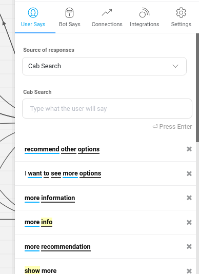
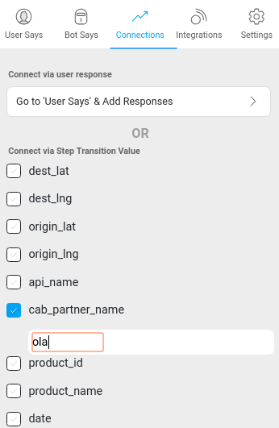

# Connecting Nodes

While a single node by itself is capabale of detecting a user intent, collecting entities and calling an API function. The real power and intelligence of Haptik Bots comes from being able to connect multiple nodes together to create a much more complex and powerful flow.

A Conversation can move from one node to another based in 3 ways

1. Transitioning basis on Messages
2. Transitioning via an Entity Presence
3. Transitioning basis a particular entity value

Before we look at each of these in more details let's see how a connection is made in the first place! The easiest way to connect nodes to each other is to hold down <kbd>shift</kbd> and drag a connection from one node to another. It's that easy!

*Note that this connection is a directional connection.*

If you define more than 1 method for transitioning from 1 node to another. The rules are evaluated as an *OR* clause. i.e. If any one of the criteria are met the node will transition.

## Transitioning based on Messages

A conversation can move from one node to another node based on a particular keyword or set of messages sent by the user.

Click on the *Connection Responses* button to reach the page below

Similar to the *User Says* page, a set of user responses can be defined below for which the bot will transition. Haptik will automatically detect similar responses, enter as much data as possible to increase the intelligence of the bot.

## Transitioning via an Entity Presence

A conversation can move from one node to another once  particular entities have been collected, regardless of their value.

The screenshot below shows the detailed view of a connection. The Transition entities selected below can be defined as required for the transition to take place.

## Transitioning basis a particular entity value

A conversation can move from one node to another once  particular entities have been collected and their value matches certain values specified.

Click on the *Step Transition Values* button to reach the page below

The Screenshot below shows the specific values required per entity for a transition to take place. These values are defined basis the Entity that has been created. 

