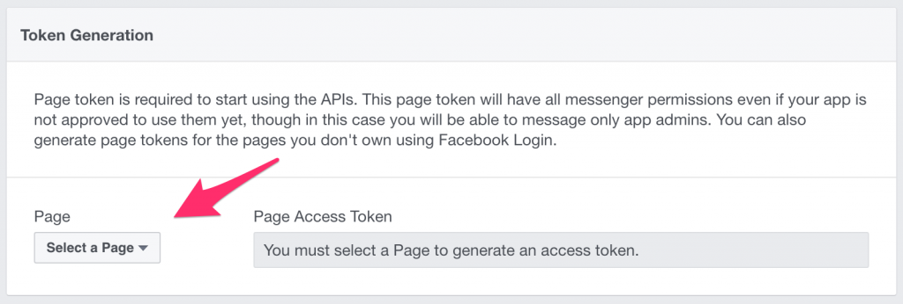

# Client SDKs
------
In this section, we'll cover the following topics:  

- [Android SDK](#android-sdk)  
- [iOS SDK](#ios-sdk)  
- [Javascript SDK](#javascript-sdk)  
- [Facebook Deployment](#facebook-deployment)  

## Android SDK

A sample application with an integrated SDK can be found on the github repo:
https://github.com/hellohaptik/haptiklib-demo

The relevant documentation, aar files and JavaDocs can be found in the folder below:
Android SDK and Related Documentation - https://drive.google.com/drive/folders/0B1dPUmeHaNriSk83YXpGaHFEV00?usp=sharing

## iOS SDK

A sample application with an integrated SDK can be found on the github repo: https://github.com/hellohaptik/HaptikLib-iOS

The relevant documentation is within the repository itself at the links below:

Integration Guide - https://github.com/hellohaptik/HaptikLib-iOS/blob/master/Integration%20Guide.md
Feature Guides - https://github.com/hellohaptik/HaptikLib-iOS/tree/master/Feature%20Guides

## Javascript SDK

Javascript Integration Documentation: https://hellohaptik.github.io/javascript_sdk/docs/

## Facebook Deployment

### Step 1

Create a new facebook page if you do not have one. Details on how to create a facebook page can be found online and at this link https://www.facebook.com/pages/create/

### Step 2

Provide the facebook user id of the administrator of the facebook page to your haptik representative. Refer here for steps on how to find your facebook id https://findmyfbid.in/

### Step 3

Once the administrator has been added to the facebook application you will be provided a link (Sample Link: https://developers.facebook.com/apps/<your app id here>/messenger/
The administrator of the facebook page must then follow the link to generate a Page Access Token for this application which will be provided to us for usage.

Provide this Page Access Token to your haptik representative.
