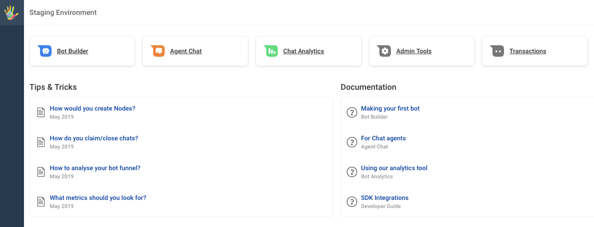
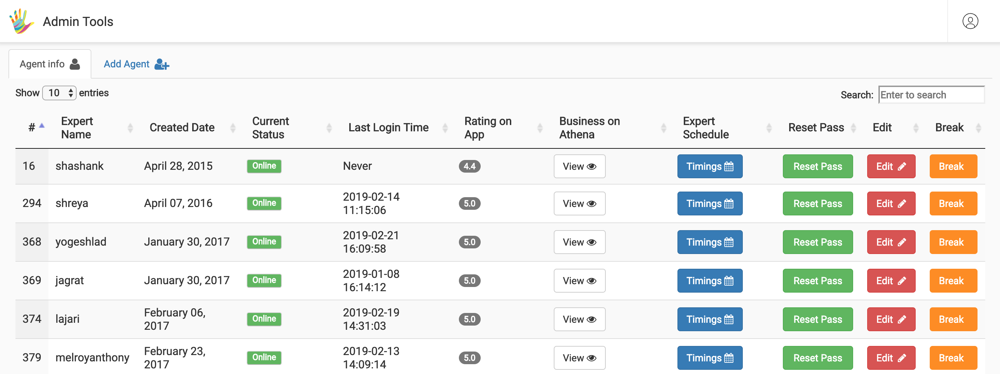
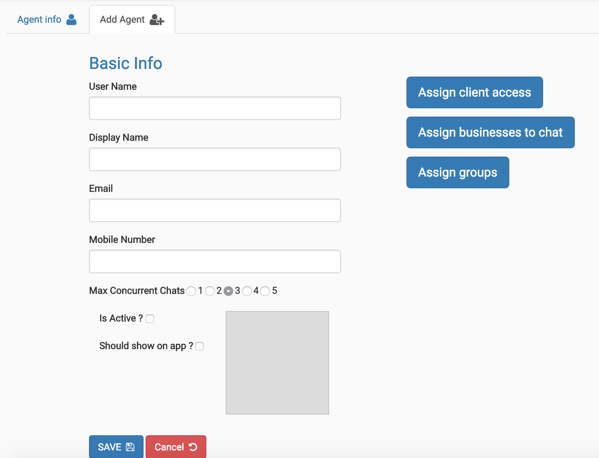

## Permission Groups

At Haptik, all our functionalities are associated with a permission. If a logged in agent performs an activity, the success or visibility of that activity depends on whether said agent has the appropriate permission to perform that functionality or not.

A combinition of these permissions is what we term as 'Permission Groups' Agents can be assigned these 'Permission Groups' via haptik administrator.

Note: As of now configuring permission groups is not avaiable for clients

By default we have two configured permission groups for clients, namely:

- Enterprise Chat Assistant

	- can receive chats
	- can mark chats as complete/waiting for user
	- can report an abusive/troll user
	- can logout

- Enterprise Chat Assistant TL

	-can receive chats
	-can view business tab
	-can modify/create a team
	-can add/remove agents from a team
	-can modify chat disposition drop downs values
	-review chats of agents
	-can assign a chat to an agent or team
	-can claim chats for himself
	-can logout

Permissions that can be added on request - Adding canned responses - Adding external tools -

While these are the default set of permission groups avaiable, if a client wishes to have these permissions segregated differently, we can have permission groups set up specifically for them.

## How to add agents with permission

Log in to Haptik and select Select Administrator

Select "Expert Dashboard" under "Enpert Management" as shown in the below screenshot

The expert dashboard tool is where one can view all the current users belonging to clients that the logged-in user has access to.

Over here he can add and edit details of a particular agent. They can view all existing agents that are currently allocated to the same client the logged in user has access to.

For adding an agent, select the tab labelled 'Add Agent', on select you will see the below screen shot where you can start entering agent information.

Fields (LHS)

- User Name: agent will log in using this value
- Display Name: agent name as displayed on our SDK's and Athena
- Email: email id which will receive the password once agent is saved
- Mobile Number: contact number of the agent
- Max Concurrent Chats: Max number of chats this agent can claim simultaneously in Athena.
- Is Active: Has to be enabled, if this is unchecked, the agent cannot login our tools.
- Should show on app: not sure

Fields (RHS)

- Assign Client Access: select the clients that this agent needs access to
  TODO: add image here
- Assign Groups: select appropriate permission groups
Once all required fields are filled and appropriate permissions have been provided. Click on Save. You will then be redirected to a page where you can upload the agents profile picture. This profile picture along with the display name parameter appears on our SDK's when an agent joins a conversation with a user.

An exmaple of the agent image appearing on our JS-SDK (javascript software development kit) can be found below

You can choose to skip above step for later.

**Note:** Initial image will be optionaly uploaded by the lead, updating the image is handled directly from individual agent profile pages.

An agent can access his user profile page by simply clicking on 'User Profile' as in below screen shot of our live chat tool

