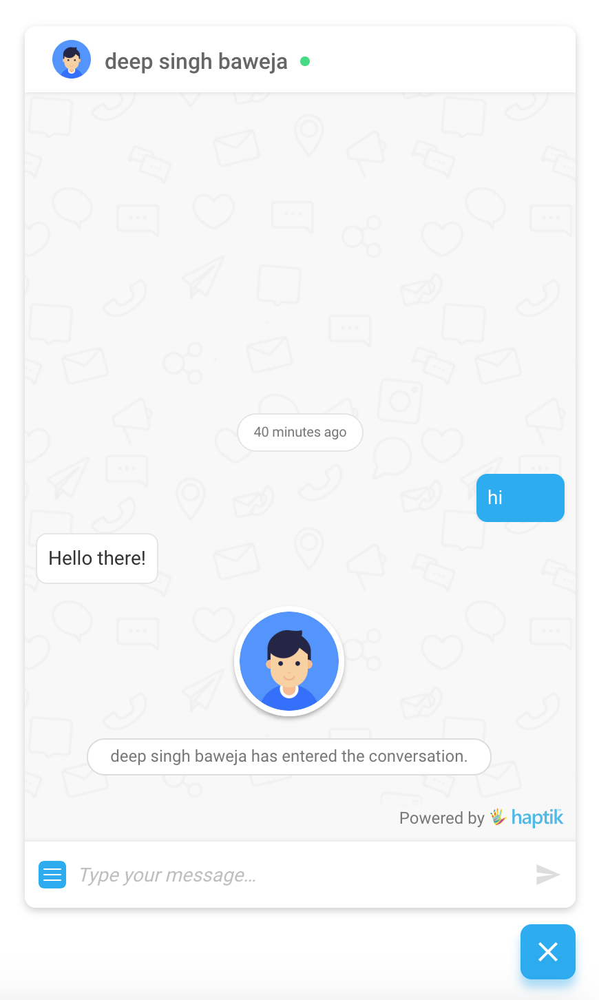
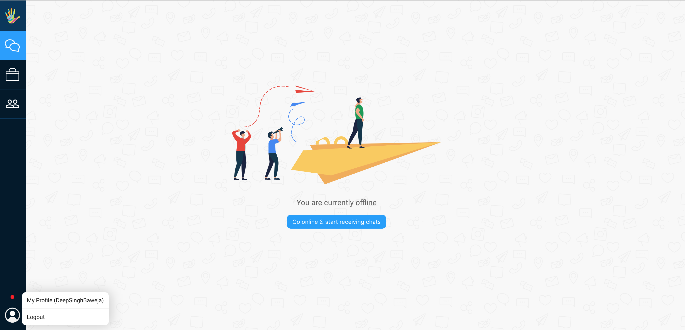

## Permissions
All our functionalities are linked to a permission, if the permission is allocated, the functionality is accessable
to the user.

## Permission Groups

A combinition of these permissions is what we term as 'Permission Groups'

Agents can be assigned these 'Permission Groups' via the haptik administrator. By default we have two configured '**Permission Groups**' for clients, namely:

### Enterprise Chat Assistant

	- can receive chats
	- can mark chats as complete/waiting for user
	- can report an abusive/troll user
	- can logout

### Enterprise Chat Assistant TL

	- can receive chats
	- can access business overwise
	- can modify/create a team
	- can add/edit chat disposition settings
	- can review chats of agents
	- can assign a chat to an agent or a team
	- can claim chats for himself
	- can logout

>  While these are the default set of permission groups available, if a client wishes to have these permissions segregated differently, they can do so.

### Permissions that can be allocated

These permissions could be added to a client specific permission group, if requested for

	- can add canned responses (pre-defined replies that agents could use)
	- can add external tools
	- will receive daily expert performance csv via mail

<!-- TODO: add a link to permission group editing here -->

## How to add agents with permission

### Step 1: Log in and select Administrator

### Step 2: Select the Expert Dashboard admin tool

>  Over here you can add/edit/view your agents

### Step 3: Click *Add Agent* tab

On select you will see the below screen shot where you can start entering agent information.

Fields (LHS)

	- User Name: agent will log in using this value.
	- Display Name: agent name as displayed on our SDK's and Athena.
	- Email: email id which will receive the password once agent is saved.
	- Mobile Number: contact number of the agent.
	- Max Concurrent Chats: Max number of chats this agent can claim simultaneously.
	- Is Active: If unchecked, the agent cannot login.
	- Should show on app: not sure

Fields (RHS)

	- Assign Client Access: checkmark the client/s that this agent will receive chats from.
	- Assign Groups: select appropriate permission groups

### Step 4: Click on Save

Your agent has been created.

### Step 5: Upload Profile Picture of Agent

#### Option 1: While creating agent
After clicking on save you will be redirected to a page where you can upload the agents profile picture.

>  This profile picture along with the display name value appears on our SDK's when an agent joins a conversation with a user.

An example of the agent image appearing on our JS-SDK (javascript software development kit) can be found below

You can choose to skip above step for later.

**Note:** Initial image will be optionaly uploaded by the lead, updating the image is handled directly from individual agent profile pages.

#### Option 2: Using profile page

An agent can access his user profile page by simply clicking on 'User Profile' as in below screen shot of our live chat tool.

Over here he can view his permissions and modify his display picture.

