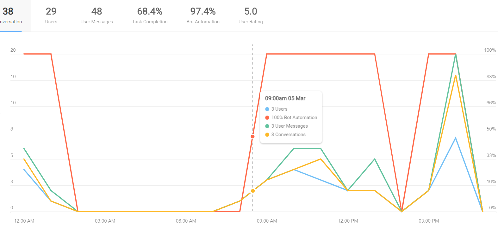
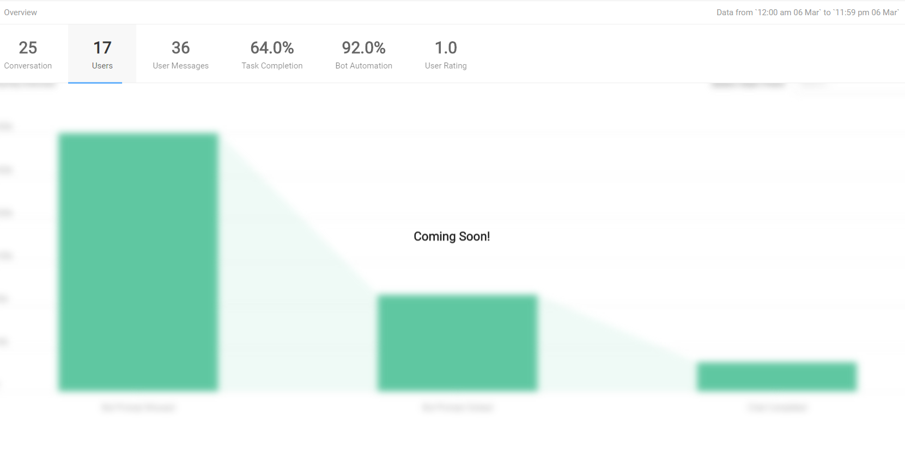
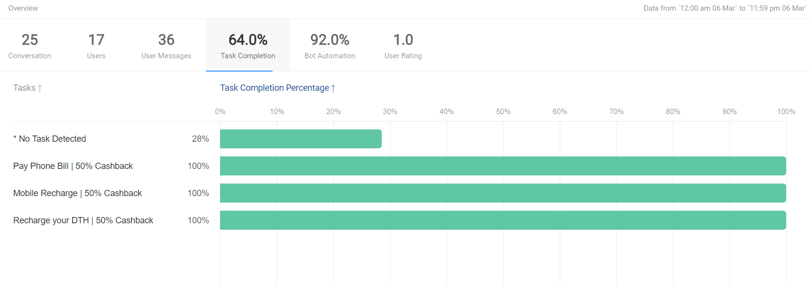
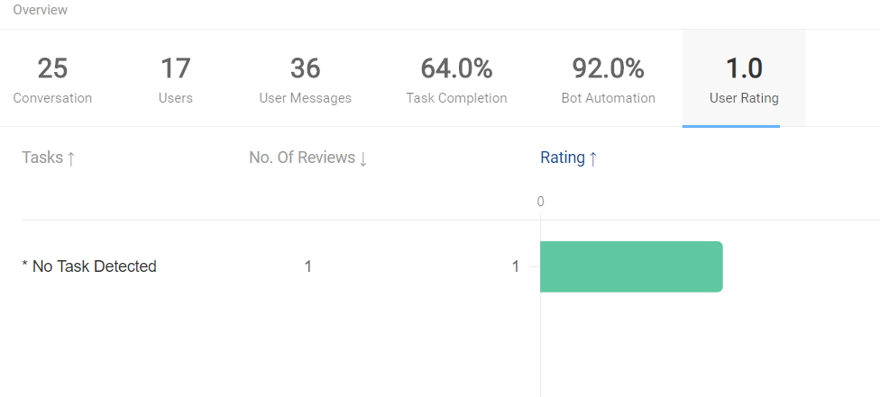

## Introduction
The Analytics tool built by haptik enables you to get a comprehensive idea of how your chatbot is performing, how users are using it, where it's failing, what the user think of it etc. 

Through this document we will explore the different types of metrics available for tracking and analysing inside the analytics tool.

The Analytics tool consists of multiple section with each section containing metrics and data about a different aspect of your chatbot. These different sections are:

* Overview
* Compare Clients
* Story Analysis
* Message Analysis
* Word Analysis
* User Journey
* User Ratings
* User Reviews

## Overview
The first section in the Analytics tool is the overview section. As the name suggests, this section helps you get a quick overview of the different aspects of your chatbot's performance. 

The Overview section provides information about:
* Conversations
* Users
* User Messages
* Task Completion
* Bot Automation
* User Rating

You can later use a different section to get more detailed information on any of these sub sections.

### Filters
On top of any page inside the Analytics tool you will find filter options. These filter options can help you filter your data by Channels or Bots from the filters on the left hand side. 

You can select `Channels` or `Bots` from the first dropdown on the left hand side and then select the particular channel or bot from the dropdown next to it.

On the right hand side of the filter section, you will find the duration filters. Using these settings you can filter the time period of the data presented.

## ***Conversation Data***
The first tab inside the Overview section is the Conversation tab. Here you can find a graph that gives you information about the user messages, conversations and automation percentage at a given time.

The data is represented in the form of a line graph with 4 different lines. The 4 different lines correspond to 
1) Number of Users
2) Number of Conversations
3) Number of User Messages
4) Bot Automation Percentage

The bot automation percentage tells you how many of the messages the bot was automatically able to respond to without human intervention.

> Knowledge Tip: A conversation is a set of messages used to accomplish a task.

In the graph the X axis is the time and the Y axis represents data about Users, Conversations, Messages and Automation. You can get data at any given time point by hovering on the graph.

## ***User Data***
The next tab in the overview section is the Users tab. This tab shows the number of users for the filtered channel or bot in the given duration period.

The graph for this data is an upcoming feature and will be documented here once it is available.

## ***User Messages***
The next tab in the Overview section is the User Messages tab. This tab measures what tasks where most initiated by user. It shows a list of tasks in the chatbot along with the number of users who initiated the task.

At the top of the tab you can see the total number of task activations and this is divided on a task to task basis below it.

> Tip: This tab can help you understand what tasks are being tapped on by the user. You should experiment the title of task or the icon and see how that nudges the task activation numbers.

## ***Task Completion***
The next tab is task completion. While the previous tab shows the task activation rate, this tab shows the task completion rate. Task completion rate is the percentage of users who completed a task after activating it.

On the top you can see the total task completion rate in percentage format. Below it the data is split from a task to task basis.

>Tip: Make improvements to the task flow and analyze the change of task completion rate to see how the improvement is performing.

## ***Bot Automation***
The next tab is Bot Automation. This tab tells you about what percentage of the incoming user messages the bot was automatically able to respond to.

The graph for this tab is an upcoming feature and will be documented here once it is ready.

## ***User Rating***
The final tab is User Rating. This tab tells you how users rated the different tasks in the chatbot. The rating is optional and is given on a scale of 1-5 stars.

On the top of the tab you can see the average rating given across all tasks and below it you have the data split from a task to task basis.

> Tip: You can try to improve the task flow and see how the user rating changes for the task accordingly to measure your improvements.