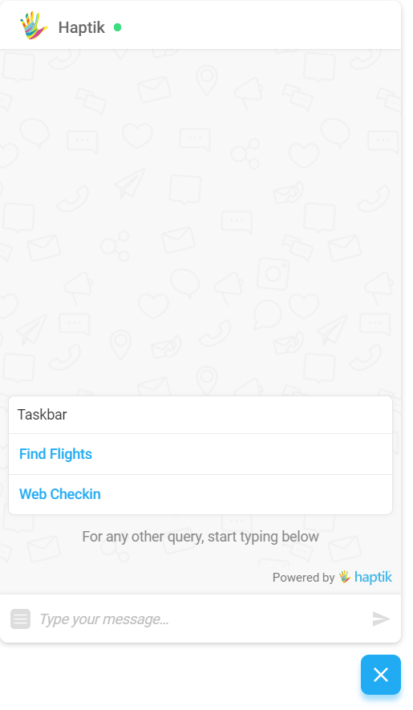

## Introduction
As we learnt recently, the analytics tool provides you with different metrics to measure your bot's performance. But before going into these metrics, it is important to understand a few core concepts.

## Messages
Messages are basically what the user and the bot use to communicate with each other. The user tells the bot what they want through a message and the bot responds to the user through a message again.

## Chats
Users send messages to the bot to achieve a goal. For example the goal might be to find the available flights. To get to this goal there might be a sequence of to and fro messages between the bot and the user. This collection of two way messages to achieve a goal is called a chat.

> Note: A Chat is a collection of Messages.

## Conversations
Conversations can be thought of as sessions. In one session a user might try to achieve multiple goals. For example they might first try to find available flights, then book one of those flights and finally do a web checkin for the booked flight. To achieve each of these goals the user completes a chat. The collection of these chats together is called a Conversation.

> Note: Conversation is a collection of Chats.

## Tasks
Tasks are high level goals that the bot builder has configured as flows in the chatbot. These tasks are generally available in the taskbar of a chatbot. These can be thought of as high level menu items of a chatbot.

## Bot Breaks
There will be times when the bot will not be able to understand the message sent by the user. Such messages are called Bot Break Messages.

In such cases we might either send the user a pre-confgured bot break message or hand the chat to an agent.