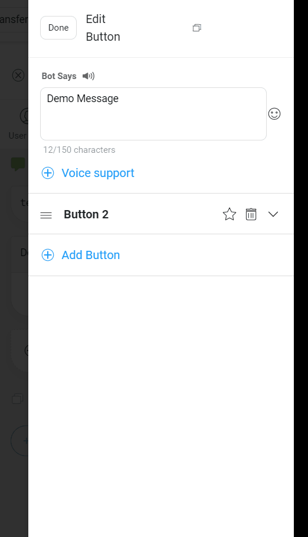

## Overview
Haptik platfrom allows you to open a standard webview, where you can load a webpage right inside the chat window. This let's you offer new and 
better experiences that might not be possible using current HSLs. Using a webview is a quicker way to build custom UI elements compared to building a new HSL.

Webviews can be used to render custom content, take payments or other experiences which may be
difficult to offer with HSL messages. 


## Displaying the Webview

### Web SDK
You can display a webview by using buttons of type `Open Screen`. To set this follow these steps:

1) Go to bot says and add any new chat element which contains buttons. 
2) Choose the button type as `Open Screen`.
3) Choose screen to open as `Webview`.
4) Enter the link to open.
5) Set the height of the webview. This should be a number between 0 and 1. Here 0 corresponds to 0%, 1 corresponds to 100%.



### Android and iOS SDK
On the android and iOS SDK, the existing functionality can be extended by using native webview of each of the devices.


Apart from the HSL button configuration the Webview can also be displayed by sending a a Smart Action message with the
`SELF_SERVE_WEB` URI

**Smart Action Syntax**

```json
{
  "text": "Enter the message copy here.",
  "type": "BUTTON",
  "data": {
    "items": [
      {
        "actionable_text": "Button message here",
        "location_required": false,
        "uri": "SELF_SERVE_WEB",
        "is_default": 1,
        "type": "APP_ACTION",
        "payload": {
          "url": "Provide your URL Here",
          "link": "",
          "gogo_message": ""
        },
        "emoji": ""
      }
    ]
  }
}
```

## Closing the Webview

### Web SDK
On the Web SDK the webview can be closed and data transferred back to the bot by using the following javascript code:

```javascript
if (window.parent) window.parent.postMessage('<http://haptik-webview//perform-action?action=close&message=HelloWorld!!',> '*')|
```

The action parameter in the URL is used for closing the bot and the message parameter contains the message that needs to be sent when the webview is closed.

### Android and iOS SDK
The webview can be closed by redirecting itself to a url on the
`haptik-webview` domain. The Native application will listen to the a
change on the URL and the webview will be closed and a message, if
present will be sent to the user

```http
http://haptik-webview//perform-action?action=close&message={message}&message_type={message_type}
```

|Query Parameters | Value | Sample |
|-----------------|-------|--------|
| action | The action to be taken on the webview | close|
| message| The message to be sent when the webview is closed | "Thanks for providing the information"|
| message_type | The type of message to be sent | 0| 


#### Message Types in iOS

|Message Type | Code |
|-------------|------|
|MessageTypeRegular  | 0|
|MessageTypeImage    | 1|
|MessageTypeForm     | 17|
|MessageTypeNote     | 21|
|MessageTypePayment  | 23|
|MessageTypeLocation | 26|
|MessageTypeTabList  | 31|
|MessageTypeCarousel | 33|
|MessageTypeBanner   | 40|
|MessageTypeLaunchBot| 47|

#### Message Types in Android

|Message Type | Code |
|-------------|------|
|LOCATION_MESSAGE_TYPE|26|
|NOTE_MESSAGE_TYPE|21|
|NO_TYPE|-1|
|IMAGE_MESSAGE_TYPE|1|
|FORM_MESSAGE_TYPE|17|
|CAROUSEL_MESSAGE_TYPE|33|
|BOT_REPLY_MESSAGE_TYPE|18|
|TASK_TAP_MESSAGE_TYPE|38|
|ATHENA_SMART_ACTION_MESSAGE_TYPE|31|
|TRIGGER_BOT_MESSAGE_TYPE|47|
