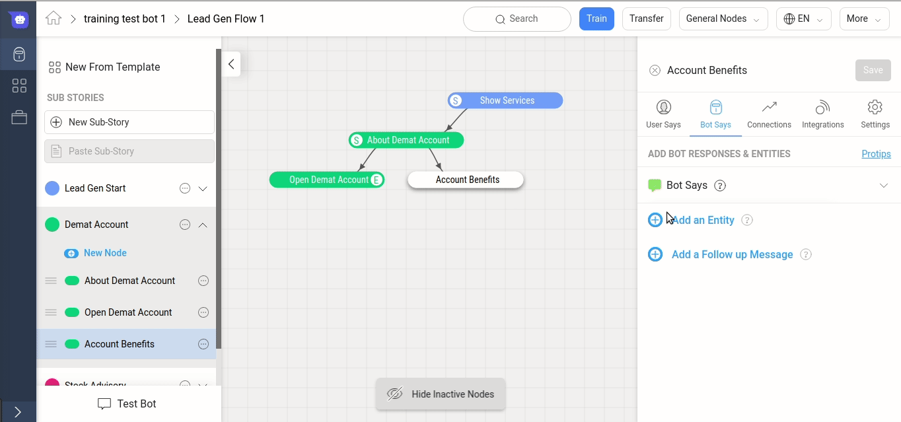
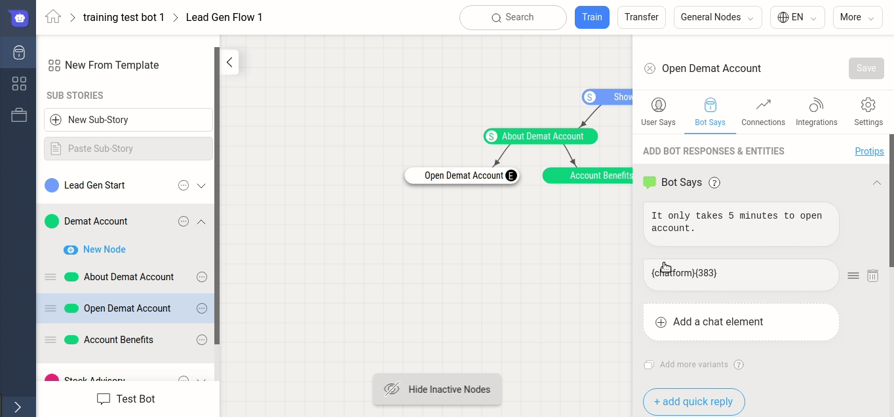
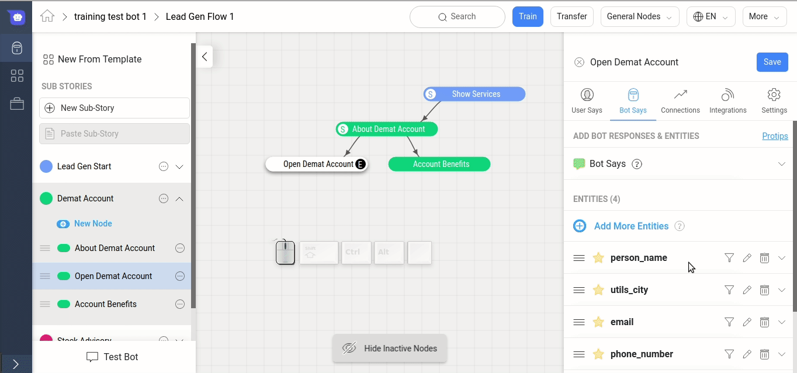

## What is Bot Says?

Once you've completed the User Says component of a node, you'll need to define the node's **Bot Says** section. Bot Says is where a Node stores the replies that are sent in response to the user's message.

This section is also used to configure the Entities that this node should collect from the user.

> **Tip:** If you don't know what an Entity is, it will be helpful to read this [Introduction to Entities](./entities) before you continue.

To get started with adding some Bot Says responses, navigate to a specific node and select the 2nd tab *Bot Says*.

Once you arrive at the Bot Says page, you'll see the above interface. This interface might differ slightly depending on the state of the node and the responses added to it.

## Types of Responses
Depending on how the node is build, the Bot Says section can have four types of responses:

### Initial Response

This is the first message that the bot sends out when the node is detected and it doesn't know about any entity on the node.

When you have multiple entities, consider the Initial Response to be the opening message for the node. In some cases, this can be the same as the response in "Entity Response" of the first Entity on the node.

When there is only one entity present, this section is disabled as it is the same as *Entity Response* of the first Entity on the node. For Example, if you want to collect the answer to a question, your Bot Says would look something like below:

### Entity Responses
If you have Entities present on a node, then Entity Response is the response that the bot will send when it doesn't know the Entity's value.

For example, if you want to collect the User's name, you could ask *"What is your name?"* in the Entity Response. Now If the User replies back with *"My name is Bruce Wayne"*, then "Bruce Wayne" will be extracted as an entity by our NER. These entities can then be used to create personalized and advanced flows for every user and hence, build better bots.

> **Tip:** You can create your own Entities or use System Entities provided as a part of the Haptik Platform.

In the below example, the Bot will start with the response from "Initial Response".
Then, it will start looking for the Entities in the Entity Response. If the bot knows the Entity's value, then it will skip the response and move to the next Entity Response or Final Responses.

> **Note:** You can set an Entity Response only for Mandatory Entities. To know more about the difference between Mandatory and Non-Mandatory entities, refer [this](../entities).

### Final Response

Once all the entities have been collected, the bot finally replies with the responses from this section. This is usally a the closing message for that node.

In cases where the node is a Start node or an Intermediate node,the Final Response section is useful to send a response to continue the user to the next part of the flow.

> Note: Final Response isn't applicable if the node doesn't have any entities as the Initial Response itself acts like the Final Response.

### Follow Up Message

If the user is inactive for a specific interval, then the the bot replies with the Follow Up message. The delay interval for this message can be set using the slider, and can be set between 20 seconds to 20 minutes.

> Tip: Use Follow Up messages to collect feedback or increase engagement on your bot.

> Note: Follow up message will be sent only if the user has not replied back after reaching that node and the chat is in Bot or Complete state.

## Priority of Responses:
As explained above, the Response to be sent is chosen from a Top to Down order i.e.
1. If no entity value is known, then send the response Initial Response Section
2. Depending on the order of Mandatory Entities, the response will be sent from the Entity whose value is not known. So in the above example, where add person_name, utils_city, email and phone_number as mandatory Entities, it will send the same.
3. Once value of all Mandatory entities is known, the Final Response is sent, if applicable.

## Structure of a Response
Each of the abo
ve four types of response (Initial Response, Entity Response, Final Response, and Delay Message) are composed of **Variants**, **Message** and **Quick replies**.

### Variants
A bot response can consist of multiple variants where each variant is an independent message. All variants should imply the same meaning as the bot chooses a variant randomly to avoid being repetitive even when asked the same question.

Each variant is composed of Messages and Quick Replies.

### Message
A variant can have multiple message bubbles. Each message is a separate _text_ from the bot. Instead of putting a long message into just one message bubble, you can split it into multiple shorter messages. However, you should avoid adding more than 3-4 messages in a single variant.

> Tip: You can use the HSL builder to simplify creation of complicated responses like Carousel, Images and Buttons.

### Quick Replies
In addition to providing the bot response, you might also want to include prompts for how to reply back to the bot again. These pre-defined prompts are called Quick Replies.

For example, if the bot asks a Question "Did you like our product?", you can add "Yes" and "No" as quick replies. So when the bot addresses the question to the user, the user is shown buttons "yes" and "No" which they can select from to reply back easily.

> **Tip:** You should use Quick Replies to help the user navigate within a flow.

## ProTips
You can create personalised responses by using specific tags in the bot response.
To view the ProTips, you can follow the steps below.

There are 2 categories of ProTips available:
1. Customizing message appearance:
   - You can customize the appearance of the response by using combinations of **\***, **~**, **`** and **_** to make the text Bold, Strikethrough, Underline, and Italic respectively.
2. Customizing message content
   - You can customize the message response using keywords like %name, %timeofday, %date etc.

For ex, if you use "*Good %timeofday*", the bot will reply back Good Morning/Afternoon/Evening depending on the time of the day.

If you scroll to the bottom, you will see **%entitytag_<entity_name>**. You can use this tag to use the value of any entity collected in the Bot Flow.

For example: If you collect the user's name using the Person Name entity and you want to use it in a follow up message, you can use the above feature.

So a response like "*Hey %entitytag_person_name! Nice talking to you.*" would become "Hey Bruce Wayne! Nice talking to you".
