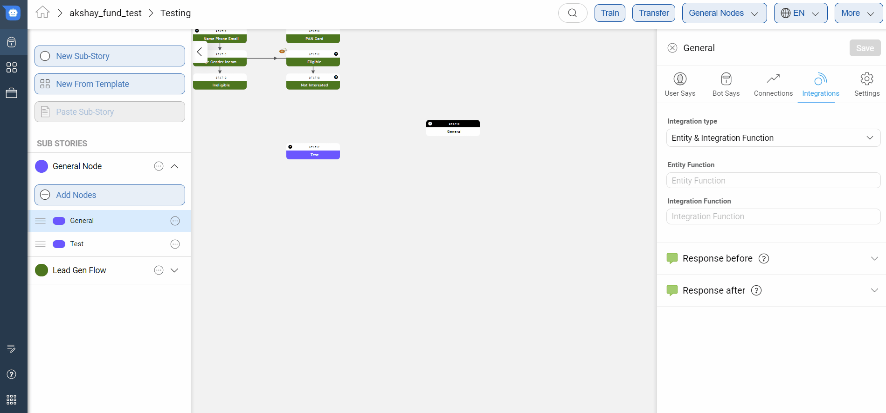
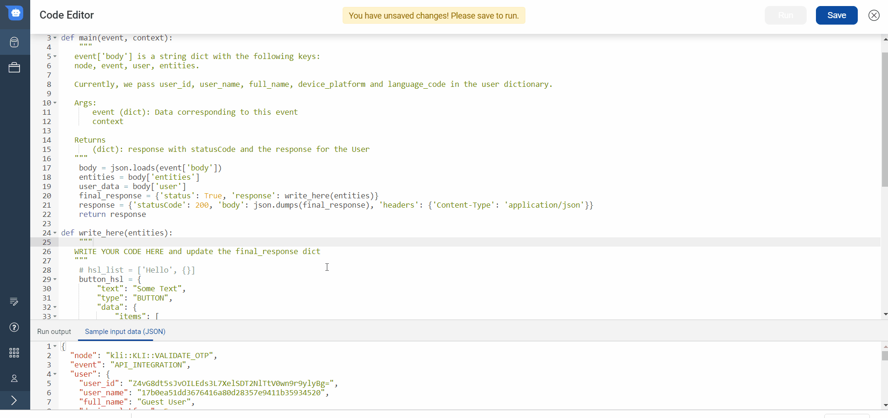

## Node Integrations
Another way to use the entities collected and run some buisness logic on them by using custom python code.


### Custom Code

A node can also be configured to execute custom code once the required entities have been collected.

To be able to do so, you can use the in-built code editor in Mogambo or paste Python3.6 specific code into the editor and save.

You can open the code editor by choosing `Custom Code` from the integrations section of a node and then clicking on the `Open Code Editor` button.




### Using Custom Code Editor

The only requirement for using the custom code editor is, the code should follow the below format. The supported programming language is Python 3 and above.

If any syntax errors or exceptions are raised by the main function, this will result in a botBreak message.

```python
import  json

def main(event, context):
    """
    event['body'] is a string dict with the following keys:
    node, event, user, entities.

    Currently, we pass user_id, user_name, full_name, device_platform and language_code in the user dictionary.

    Args:
        event (dict): Data corresponding to this event
        context

    Returns
        (dict): response with statusCode and the response for the User
    """
    body = json.loads(event['body'])
    entities = body['entities']
    user_data = body['user']
    user_details = body['user_details']
    conversation_details = body['conversation_details']
    final_response = {'status': True, 'response': write_here(), 'user_details':user_details, 'conversation_details':conversation_details}
    response = {'statusCode': 200, 'body': json.dumps(final_response), 'headers': {'Content-Type': 'application/json'}}
    return response

def write_here(*args):
    """
   WRITE YOUR CODE HERE and update the final_response dict
   """
    # hsl_list = ['Hello', {}]
    button_hsl = {
        "text": "COMPLETE BLOOD COUNT; CBC",
        "type": "BUTTON",
        "data": {
            "items": [
                {
                    "actionable_text": "View Price",
                    "location_required": False,
                    "is_default": 0,
                    "uri": "LAUNCH_CHANNEL",
                    "type": "TEXT_ONLY",
                    "payload": {
                        "gogo_message": "",
                        "message": "I want to check the price of this test"
                    }
                },
                {
                    "actionable_text": "View Details",
                    "location_required": False,
                    "is_default": 0,
                    "uri": "LINK",
                    "type": "APP_ACTION",
                    "payload": {
                        "url": "XYZ.COM",
                        "gogo_message": ""
                    }
                }
            ]
        },
        "isNew": False
    }
    return [json.dumps(button_hsl)]

```

The HSL message that you want the bot to respond with should be sent as a JSON in the body of the returned response object from the main function. 

##### Supported Packages 
1. *Default* - [List of Packages here](https://gist.github.com/gene1wood/4a052f39490fae00e0c3#file-all_aws_lambda_modules_python3-6-txt)
2. *Extra packages* -  
chardet-3.0.4 
gspread-3.1.0 
httplib2-0.13.1 
idna-2.8 
mysqlclient-1.4.2 
oauth2client-4.1.3 
pyasn1-0.4.6 
pyasn1-modules-0.2.6 
pytz-2019.2 
redis-3.2.1 
requests-2.22.0 
rsa-4.0 
six-1.12.0 
unicodecsv-0.14.1 
urllib3-1.25.3


### Live Testing your Code
The full screen code editor allows you to live test your code with a configurable input. This will help you evaluate if your code is working as expected.

You can configure the input by modifying the JSON in the `Sample Input Data` section at the bottom of the code editor. The only requirement is that the input JSON should have these keys mandatorily:

* entities - This key will contain data about the entities captured in the bot.
* user_data - This key will contain data about the user.


After configuring the input json data you can test the code by clicking on the `Run` button at the top of the screen.

> **Note**: You need to save the code to be able to run it.

When you click on the `Run` button, the code will be executed using the sample input data and the output and logs will be shown at the bottom of the code executor window.




### Pre-Transfer

`Train Bot` prepares the code for production. Hence, you should make sure to call `Train Bot` if there are any changes in the custom code integration before transferring the bot to production.
