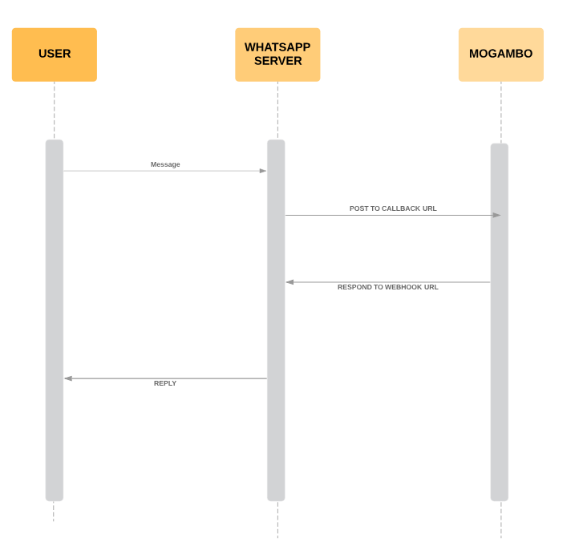
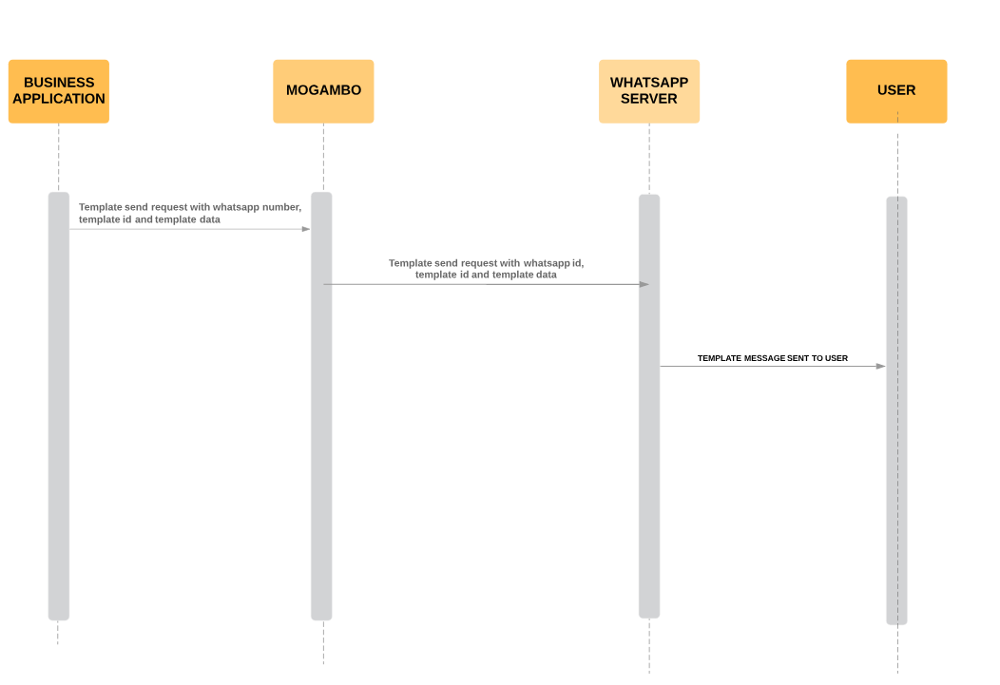

There are two types of conversations that are possible on WhatsApp.
The first type is the regular user initiated conversation where the user sends a message to the whatsapp bot and the bot replies back to the user. The bot is allowed to reply back to the user within a 24 hour window from the last message sent by the user.

The second type of conversational flow is bot initiated conversations. In this type whenever a transactional event occurs for eg: user bought a movie ticket, an ebill has been generated etc. a pre approved template message can be sent out. 

Templates are also known as HSMs. HSM stands for Highly Structured Message. A HSM template will have placeholders in it which can be filled with dynamic user specific values. Here’s a sample HSM:

> Hi {{1}}! Thanks for starting your personal training plan. We’ll send you    a {{2}} update with your new schedule. You can log-in online using your      training ID {{3}}. Stay fit! 

After filling in user specific data the HSM will be sent out as:

> Hi Joey! Thanks for starting your personal training plan. We’ll send you a   weekly update with your new schedule. You can log-in online using your       training ID 123456. Stay fit! 

Media support for HSMs is currently does not exist but will be opened soon. However,dynamic user specific links can be added in the HSM.

## User initiated Conversations

Here's how a user initiated conversation works:

1) User sends message to Business Whatsapp Number
2) The message is received as an incoming message notification on the Whatsapp Instance.
3) The Whatsapp instance sends the message to Mogambo.
4) Mogambo processes the message and sends the reply to the Whatsapp Instance.
5) The Whatsapp instance sends the reply to the user.

The Incoming message notification sends the message and the wa_id(whatsapp id) to the callback. The wa_id is enough to identify the user and send the response back to them.

## Bot Initiated Conversations - Message Templates
Transactional templates are bot Initiated messages. Example: Sending E-Ticket after completing booking on website. Whatsapp charges for every transactional template sent. The templates have to be transactional and can’t be promotional in nature. There are 3 major steps involved in this process:

**Template Approval**
The first step is to create a message template according to whatsapp guidelines and request for approval. The approval process can take 2-3 weeks.

**User Opt-In**
The second step is to get an opt-in from user for sending messages to them on whatsapp. 

**Sending the template**
Finally when the business wants to send a template message they make an API request to Mogambo with the whatsapp number, the template id and the data to be filled in the template. Mogambo then fetches the whatsapp id for the number and if that is found it sends a request to the whatsapp server instance with the template id, whatsapp id and the data for the template. 

The whatsapp server instance then sends the message template to the user.

